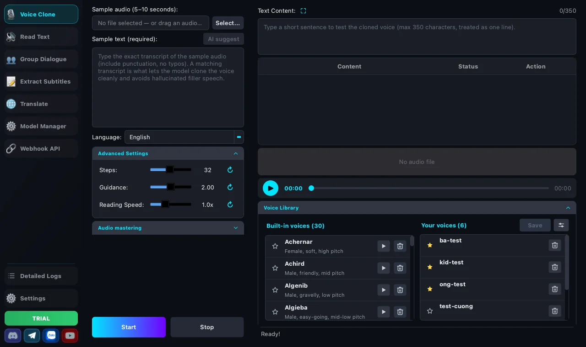
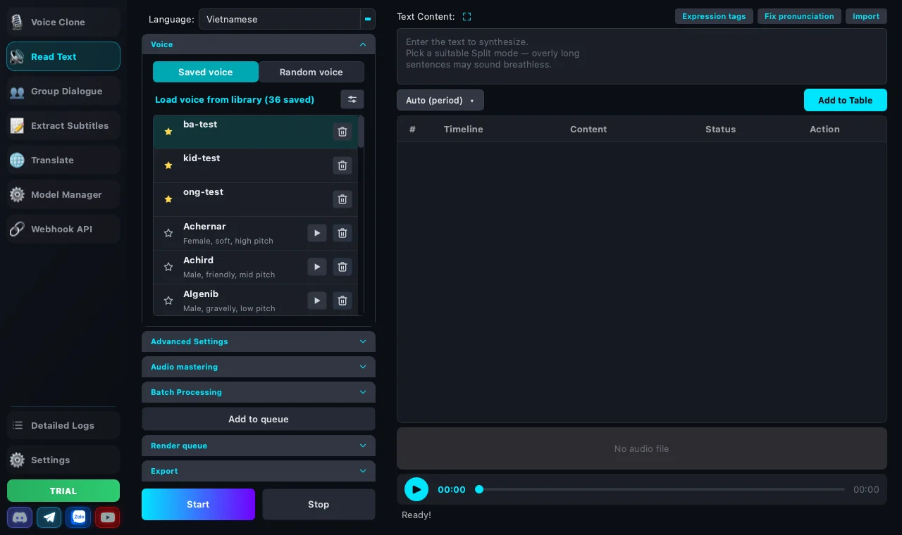
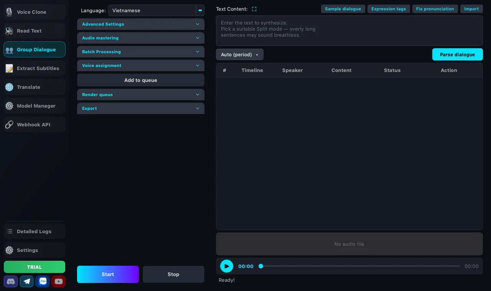
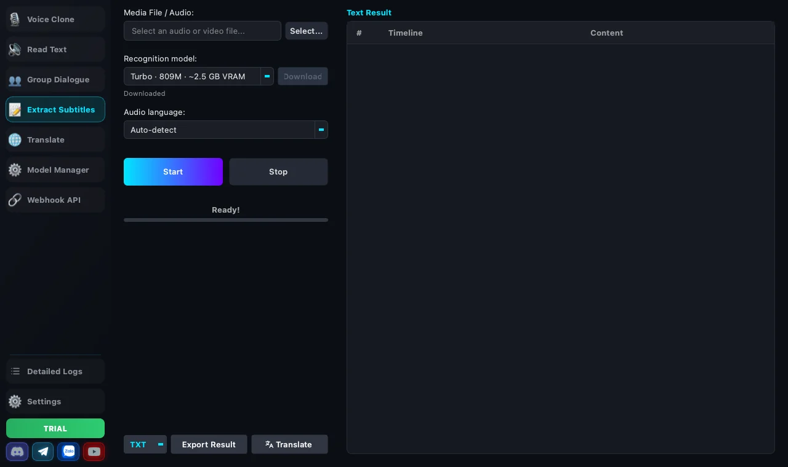
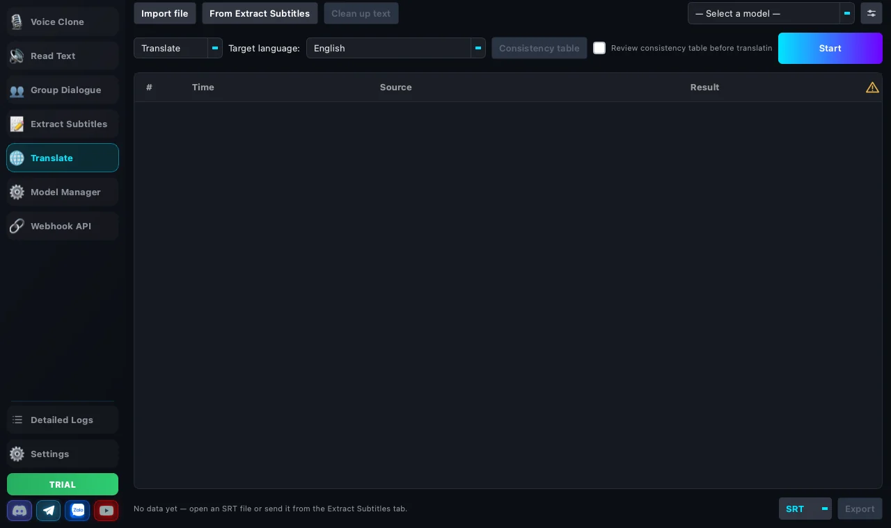
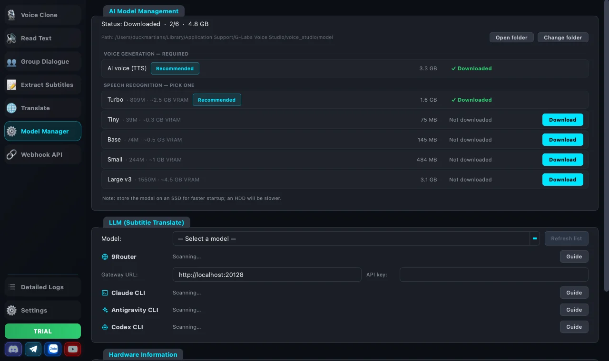
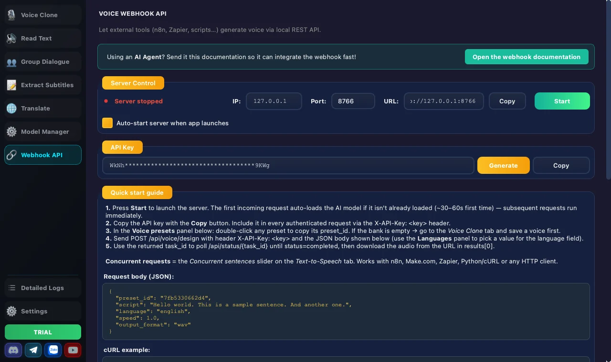

<h1 align="center">G-Labs Voice Studio</h1>

<p align="center"><b>آپ کے اپنے کمپیوٹر پر چلنے والی AI آواز کی ڈیسک ٹاپ ایپ — چند سیکنڈ کی آڈیو سے آواز کلون کریں، 600 سے زیادہ زبانوں میں متن پڑھوائیں، کئی آوازوں والے مکالمے بنائیں، آڈیو/ویڈیو سے سب ٹائٹل نکالیں اور AI سے سب ٹائٹل کا ترجمہ کریں۔</b></p>

<p align="center">
  <a href="README.md">Tiếng Việt</a> ·
  <a href="README.en.md">English</a> ·
  <a href="README.pt-BR.md">Português</a> ·
  <a href="README.tr.md">Türkçe</a> ·
  <a href="README.zh-CN.md">简体中文</a> ·
  <a href="README.hi.md">हिन्दी</a> ·
  <a href="README.bn.md">বাংলা</a> ·
  <b>اردو</b> ·
  <a href="README.ru.md">Русский</a>
</p>

<p align="center">
  <a href="https://drive.google.com/drive/u/0/folders/1BOH-3lF_rGu8QU4b07pt203a-WdOAb-G"></a>&nbsp;
  <a href="https://drive.google.com/drive/u/0/folders/1iEAUo5XOcr_3VmDoqIaiuq-zG8BLnxta"></a>
</p>

---

## انسٹال کریں

### مرحلہ 1 — اپنے کمپیوٹر کے لیے درست بلڈ منتخب کریں

بلڈ سرکاری Google Drive فولڈرز سے فراہم کیے جاتے ہیں:

| آپ کا کمپیوٹر | Google Drive | نوٹ |
|---|---|---|
| 🪟 **Windows 10/11 (64-bit)** | [Windows](https://drive.google.com/drive/u/0/folders/1BOH-3lF_rGu8QU4b07pt203a-WdOAb-G) | ایک `.zip` — ایکسٹریکٹ کریں اور چلائیں، کوئی انسٹالر نہیں |
| 🍎 **Apple چپ والا Mac (M1/M2/M3/M4…)** | [macOS Apple Silicon](https://drive.google.com/drive/u/0/folders/1iEAUo5XOcr_3VmDoqIaiuq-zG8BLnxta) | ایک `.dmg`، macOS 12 یا نیا درکار |

> **Intel Mac سپورٹ نہیں ہوتے** — صرف Apple Silicon بلڈ موجود ہے۔ معلوم نہیں آپ کے Mac میں کون سی چپ ہے؟  مینو → **About This Mac**: **Chip** والی سطر میں "Apple M…" ہو تو چلے گا؛ **Processor** والی سطر میں "Intel…" ہو تو نہیں۔

### مرحلہ 2 — انسٹال کریں

<details open>
<summary><b>🪟 Windows پر</b></summary>

1. Windows کی `.zip` ڈاؤن لوڈ کریں (مثلاً `G-Labs-Voice-Studio-v2.0.2-win.zip`) اور کسی بھی فولڈر میں **ایکسٹریکٹ** کریں — ڈرائیو پر کم از کم 10 GB خالی جگہ ہونی چاہیے (بعد میں ڈاؤن لوڈ ہونے والے AI ماڈل کئی GB لیتے ہیں)۔
2. ایکسٹریکٹ شدہ فولڈر کھولیں اور **`G-Labs-Voice-Studio.exe`** چلائیں (باقی سب کچھ `data` سب فولڈر میں ہے — اسے منتقل نہ کریں)۔
3. اگر **"Windows protected your PC"** (SmartScreen) ظاہر ہو: **More info** → **Run anyway** پر کلک کریں۔ *(ایپ Microsoft سرٹیفکیٹ سے سائن نہیں ہے، اس لیے Windows خبردار کرتا ہے — یہ وائرس نہیں ہے۔)*
4. **شارٹ کٹ بنائیں:** `G-Labs-Voice-Studio.exe` پر رائٹ کلک → **Send to** → **Desktop (create shortcut)**، تاکہ اگلی بار جلدی کھول سکیں۔

> ⏳ **پہلی بار کھلنے میں 30–60 سیکنڈ لگ سکتے ہیں** (اسپلیش اسکرین دیر تک رکی رہتی ہے)، کیونکہ Windows ایپ اور گرافکس لائبریریوں کی سیکیورٹی اسکیننگ کرتا ہے۔ انتظار کریں، بند نہ کریں — اگلی بار یہ جلدی کھلے گی۔

</details>

<details open>
<summary><b>🍎 macOS پر</b></summary>

1. ڈاؤن لوڈ شدہ **`.dmg`** کھولیں، پھر **G-Labs Voice Studio کا آئیکن گھسیٹ کر Applications فولڈر میں ڈالیں**۔
2. **Applications** میں **G-Labs Voice Studio** پر **رائٹ کلک** (یا Control کلک) کریں → **Open** → تصدیقی ڈائیلاگ میں دوبارہ **Open**۔ *(ایپ Apple سے notarized نہیں ہے، اس لیے **پہلی بار** اسے اسی طرح کھولنا ہوتا ہے؛ بعد میں عام طریقے سے کھلے گی۔)*
3. اگر macOS کہے کہ ایپ **"damaged / can't be opened"** ہے یا Open کا بٹن نہ ہو، تو **Terminal** کھولیں، یہ پیسٹ کریں اور Enter دبائیں:
   ```bash
   xattr -dr com.apple.quarantine "/Applications/G-Labs Voice Studio.app"
   ```
   پھر ایپ دوبارہ کھولیں۔ دوسرا طریقہ: **System Settings → Privacy & Security**، نیچے تک اسکرول کریں اور G-Labs Voice Studio کے بلاک ہونے والے پیغام کے ساتھ **Open Anyway** پر کلک کریں۔

> ⏳ **پہلی بار کھلنے میں 30–60 سیکنڈ لگ سکتے ہیں**، کیونکہ macOS پوری ایپ کی سیکیورٹی جانچ کرتا ہے۔ اگلی بار یہ جلدی کھلے گی۔

</details>

### مرحلہ 3 — سائن اِن کریں اور پلان منتخب کریں

ایپ آپ کا لائسنس چیک کر سکے، اس کے لیے **Google سے سائن اِن کرنا ضروری ہے** (Settings ⚙️ → **لائسنس اکاؤنٹس** ٹیب → **Google سے لاگ ان**)۔ ایک اکاؤنٹ **ایک وقت میں ایک ہی کمپیوٹر** پر چلتا ہے — کسی دوسرے ڈیوائس پر سائن اِن کرنے سے پرانے ڈیوائس کا سیشن ختم ہو جاتا ہے۔

| پلان | قیمت | شامل |
|---|---|---|
| **ٹرائل** | مفت | ہر جنریشن میں محدود قطاریں (ڈیفالٹ 1) — خریدنے سے پہلے یہ دیکھنے کے لیے کافی کہ آپ کا کمپیوٹر ٹھیک چلتا ہے |
| **Studio پلان** | 1 مہینہ $5 · 6 مہینے $25 · 1 سال $50 (VietQR سے 100,000đ / 500,000đ / 1,000,000đ) | لامحدود قطاریں، **رینڈر قطار**، **ترجمہ** ٹیب، **Webhook API** |

- ایپ کے اندر ہی خریدیں (Settings → **لائسنس اکاؤنٹس**): **VietQR بینک ٹرانسفر**، **PayPal** (بین الاقوامی کارڈ) یا **USDT** سے۔ پلان مدت کے حساب سے ہیں، خود بخود تجدید نہیں ہوتے، اور اسی Google اکاؤنٹ پر فعال ہوتے ہیں جس سے آپ سائن اِن کرتے ہیں۔
- Studio پلان صرف Voice Studio کا ہے اور G-Labs Studio کے Plus/Max سے **الگ** ہے۔
- ادائیگی کے بعد پہلے **24 گھنٹوں** کے اندر رقم کی واپسی ممکن ہے — دیکھیں [ریفنڈ پالیسی](https://duckspace.net/refunds.html#en)۔ پہلے مفت ٹرائل چلا کر یقین کر لیں کہ آپ کا کمپیوٹر اسے آسانی سے چلا لیتا ہے۔

---

## پہلی بار چلانا

1. **ایپ کھولیں اور خوش آمدید اسکرین پر انٹرفیس کی زبان منتخب کریں** (بعد میں Settings میں بدل سکتے ہیں)۔
2. **Google سے سائن اِن کریں** — Settings ⚙️ → **لائسنس اکاؤنٹس** → **Google سے لاگ ان**۔
3. **آواز کا ماڈل ڈاؤن لوڈ کریں** — **ماڈل مینجمنٹ** ٹیب کھولیں (یا ایپ کی ہدایت پر عمل کریں) اور AI آواز کا ماڈل ڈاؤن لوڈ کریں (کئی GB، صرف ایک بار)۔ اسپیچ ریکگنیشن ماڈل پہلی بار استعمال پر الگ سے ڈاؤن لوڈ ہوتے ہیں۔
4. **متن پڑھیں ٹیب کھولیں**، **آؤٹ پٹ زبان** منتخب کریں اور لائبریری سے ایک آواز چنیں (30 بلٹ اِن آوازیں)۔
5. متن پیسٹ کریں → **جدول میں شامل کریں** → **چلانا شروع کریں**۔ ہر قطار سنیں، پھر فائل محفوظ کرنے کے لیے **آڈیو برآمد** پر کلک کریں (ڈیفالٹ طور پر `.srt` سب ٹائٹل کے ساتھ)۔

---

## خصوصیات

<p align="center">
  
</p>

- **آپ کے کمپیوٹر پر چلتی ہے** — ماڈل ڈاؤن لوڈ ہونے کے بعد آواز بنانا اور ٹرانسکرپشن مقامی طور پر چلتے ہیں (NVIDIA GPU، Apple Metal یا CPU)؛ آپ کی آڈیو اور متن کسی سرور پر نہیں بھیجے جاتے۔ صرف ترجمے والا ٹیب سب ٹائٹل کا متن آپ کے منتخب AI فراہم کنندہ کو بھیجتا ہے۔
- **آواز کلوننگ** — 5–10 سیکنڈ کے نمونے سے کوئی بھی متن بالکل اسی آواز میں پڑھوائیں۔
- **آواز ڈیزائن** — جنس، عمر، پچ، انداز اور لہجے سے نئی آواز بنائیں؛ نمونہ فائل کی ضرورت نہیں۔
- **600 سے زیادہ آؤٹ پٹ زبانیں** — ویتنامی، انگریزی، چینی، جاپانی، کوریائی، فرانسیسی، جرمن، ہسپانوی اور بہت سی دوسری۔
- **کئی آوازوں والا مکالمہ** — `<نام>: مکالمہ` اسکرپٹ، ہر کردار کی اپنی آواز اور رفتار۔
- **سب ٹائٹل نکالنا** — MP3، WAV، M4A، FLAC، MP4، MOV… کی ٹرانسکرپشن؛ لفظ کی سطح کی ٹائمنگ کے ساتھ TXT یا SRT ایکسپورٹ۔
- **AI سب ٹائٹل ترجمہ** *(Studio پلان)* — `.srt`، `.vtt`، `.ass`، `.sbv`، `.txt` کا ترجمہ یا پروف ریڈ؛ ٹائمنگ اور قطاروں کی تعداد بالکل ویسی ہی رہتی ہے۔
- **آواز کی لائبریری** — 30 بلٹ اِن آوازیں، اپنی آوازیں محفوظ کریں، ⭐ پسندیدہ پن کریں، `.vcp` فائل میں بیک اپ/ریسٹور کریں۔
- **آڈیو کی باریک ترتیب** — 6 پروسیسنگ موڈ، والیوم برابر کرنا، 13 تاثراتی ٹیگ، اور تلفظ کی لغت جو `100%`، `25°C`، `m²` پڑھنے کا طریقہ یاد رکھتی ہے۔
- **لچکدار ایکسپورٹ** — WAV یا MP3، ایک مشترکہ فائل یا ہر جملے کی الگ فائل، `.srt` کے ساتھ؛ کسی ایک قطار کو ⬇ بٹن سے ڈاؤن لوڈ کریں۔
- **رینڈر قطار** *(Studio پلان)* — کئی اسکرپٹس قطار میں لگائیں؛ ایپ انہیں ایک ایک کر کے چلاتی اور فائلیں محفوظ کرتی ہے۔
- **Webhook API** *(Studio پلان)* — n8n، Make، Zapier، Python/cURL یا AI ایجنٹس کے لیے مقامی REST سرور۔
- **ہارڈ ویئر سنبھالتی ہے** — غیر موافق گرافکس کارڈ ہونے پر واضح اطلاع کے ساتھ CPU پر منتقل ہو جاتی ہے؛ فارغ رہنے پر GPU میموری خود بخود خالی ہو جاتی ہے۔
- **9 انٹرفیس زبانیں** — Tiếng Việt، English، Português، Türkçe، 简体中文، हिन्दी، বাংলা، اردو، Русский۔

---

## صفحات

صفحات بائیں سائیڈبار میں ہیں۔ تینوں آواز والے صفحات (آواز کلون، متن پڑھیں، گروپ مکالمہ) ایک ہی ترتیب سے چلتے ہیں: **آؤٹ پٹ زبان** منتخب کریں → متن پیسٹ کریں یا **فائل درآمد** (`.txt`، `.srt`) → **جدول میں شامل کریں** (ایپ آپ کے منتخب **تقسیم موڈ** کے مطابق جملے تقسیم کرتی ہے، قطاروں کی تعداد کے پیش منظر کے ساتھ) → **چلانا شروع کریں** → سنیں → **آڈیو برآمد**۔

### 🔊 آواز کلون



نمونے کی آڈیو فائل لوڈ کرنے کے لیے **منتخب...** پر کلک کریں (صاف آواز، کم شور)، پھر استعمال ہونے والا بالکل درست 3–30 سیکنڈ کا حصہ چننے کے لیے **ویوفارم پر نمایاں باکس گھسیٹیں** — چھوڑنے پر کنارے قریب ترین خاموشی پر جم جاتے ہیں؛ 5 منٹ / 50 MB سے لمبی فائلوں کے پہلے 30 سیکنڈ لیے جاتے ہیں۔ *نمونہ متن* **لازمی** ہے اور نمونے کے الفاظ سے بالکل مطابقت رکھنا چاہیے (رموزِ اوقاف اور ہجے سمیت)؛ **✨ AI تجویز** آپ کے لیے ٹرانسکرائب کرتا ہے، لیکن جنریٹ کرنے سے پہلے جانچ لیں۔ کلوننگ مکمل ہونے پر ایپ آواز سننے اور ایک کلک میں لائبریری میں محفوظ کرنے کی پیشکش کرتی ہے۔

### 🎛️ متن پڑھیں



لائبریری سے کوئی آواز چنیں، یا *جنس، عمر، پچ، انداز، لہجے* سے نئی آواز بنانے کے لیے **آواز ڈیزائن** کھولیں۔ ڈیزائن کی ہوئی آواز پسند آئی؟ ٹیبل میں اس کی قطار منتخب کریں → دوبارہ استعمال کے لیے لائبریری میں **محفوظ کریں** کریں۔ **سمارٹ انضمام** موڈ چھوٹے جملوں کو ایک حروف کی حد تک رواں قطاروں میں جوڑتا ہے، لیکن ہمیشہ جملے کے اختتام پر ہی توڑتا ہے۔ **تاثراتی ٹیگ** بٹن سے ٹیگ دیکھیں اور کرسر کی جگہ ڈالیں۔

### 💬 گروپ مکالمہ



کئی کرداروں والا اسکرپٹ لکھیں — پوڈکاسٹ، آڈیو ڈرامہ اور انٹرویو کے لیے بہترین:

```
<میزبان>: سب کو خوش آمدید۔
<Mai>: ہیلو، پروگرام میں آ کر بہت خوشی ہوئی۔
<Minh>: مجھے بھی — آج ہم کس بارے میں بات کریں گے؟
```

کردار کا نام سطر کے شروع میں `< >` میں لکھیں (`:` اختیاری ہے، ناموں میں بڑے/چھوٹے حروف کا فرق نہیں)۔ مثال کے لیے **نمونہ مکالمہ**، پھر **مکالمہ تجزیہ** پر کلک کریں — **آواز کی تفویض** پینل کھلتا ہے جہاں ہر کردار کو لائبریری سے ایک آواز اور اپنا **رفتار** سلائیڈر (0.5× → 2×) دیں۔

### 📝 سب ٹائٹل نکالیں



آڈیو/ویڈیو فائل (MP3، WAV، M4A، FLAC، MP4، MOV…)، بولی جانے والی زبان اور ریکگنیشن ماڈل منتخب کریں (Tiny → Large v3، ہر ایک کے ساتھ درکار VRAM لکھا ہے) اور چلائیں۔ سب ٹائٹل کی قطاریں الفاظ کے ٹائم اسٹیمپ سے بنتی ہیں اور حقیقی وقفوں / جملے کے اختتام / حروف کی حد پر ٹوٹتی ہیں؛ *زیادہ سے زیادہ حروف، زیادہ سے زیادہ سیکنڈ، وقفے کی حد* بدلتے ہی ٹیبل فوراً اپ ڈیٹ ہو جاتا ہے، دوبارہ ٹرانسکرائب کرنے کی ضرورت نہیں۔ ٹیبل میں براہِ راست ترمیم کریں اور `.txt` یا `.srt` ایکسپورٹ کریں۔

### 🌐 ترجمہ *(Studio پلان)*



سب ٹائٹل کا کسی دوسری زبان میں ترجمہ کریں یا ہجے اور سطروں کی تقسیم درست کریں — **صرف متن بدلتا ہے؛ ٹائمنگ اور قطاروں کی تعداد وہی رہتی ہے**۔

1. **ماڈل مینجمنٹ → LLM** میں ایک بار سیٹ اپ: **9Router** (آپ کی مشین پر چلنے والا گیٹ وے — پتہ اور API key درج کریں)، **Claude CLI**، **Antigravity** (`agy`) یا **Codex CLI** (انسٹال کر کے سائن اِن کریں) منتخب کریں۔ ہر قطار میں انسٹال کمانڈ والا **گائیڈ** بٹن ہے؛ انسٹال کے بعد **فہرست تازہ کریں** پر کلک کریں، ایپ اسے پہچان کر ماڈلز کی فہرست دکھاتی ہے۔
2. `.srt`، `.vtt`، `.ass`، `.sbv`، `.txt` کو **فائل درآمد** کریں — یا **سب ٹائٹل سے لیں**۔ `.txt` میں ٹائمنگ نہیں ہوتی، اس لیے ایپ عارضی وقت دیتی ہے اور آپ کو بتا دیتی ہے۔
3. تجویز: **متن ترتیب دیں** جملے کے بیچ میں کٹے ٹکڑوں کو جوڑتا ہے (ویڈیو ایڈیٹرز سے ایکسپورٹ کیے گئے سب ٹائٹل میں عام)، لاگو کرنے سے پہلے *"120 قطاریں → 68 قطاریں"* جیسا پیش منظر دکھاتا ہے۔
4. **ترجمہ**، **ترمیم** یا **ترجمہ + ترمیم** منتخب کریں، ہدف زبان اور ماڈل چنیں، پھر **چلانا شروع کریں**۔
5. **ہم آہنگی جدول** پوری فائل کے لیے نام، اصطلاحات اور طرزِ تخاطب طے کرتا ہے اور ہر حصے کے ساتھ بھیجا جاتا ہے؛ آپ اس میں ترمیم کر سکتے ہیں، اور چاہیں تو ترجمے سے پہلے جائزے کے لیے رک سکتے ہیں۔
6. **نتیجہ** کالم جانچیں (AI سے رہ جانے والی قطاروں پر ⚠ کا نشان ہوتا ہے اور اصل متن برقرار رہتا ہے)، **SRT / VTT / TXT** منتخب کریں اور **برآمد کریں** کریں۔

### 📚 ماڈل مینجمنٹ



ہر ماڈل کی ایک قطار، سائز اور حالت کے ساتھ: AI آواز کا ماڈل اور ریکگنیشن سائز (Tiny، Base، Small، Turbo، Large v3)۔ صرف ضروری ماڈل ڈاؤن لوڈ کریں اور **ماڈل فولڈر** بدلیں (مثلاً C ڈرائیو بچانے کے لیے D ڈرائیو پر — پرانا ماڈل فولڈر کاپی کریں یا ایپ کو دوبارہ ڈاؤن لوڈ کرنے دیں)۔ ترجمے کے لیے **LLM** فراہم کنندہ اور **خودکار VRAM آزاد کریں** ٹائمر بھی یہیں سیٹ ہوتے ہیں۔

### 🗒 رینڈر قطار *(Studio پلان)*

ایک اسکرپٹ جنریٹ کر کے ہاتھ سے ایکسپورٹ کرنے کے بجائے **قطار میں شامل کریں** پر کلک کریں — موجودہ اسکرپٹ + آواز + سیٹنگز **اپنے نام اور آؤٹ پٹ فولڈر** کے ساتھ ایک کام کے طور پر محفوظ ہو جاتی ہیں۔ **قطار چلائیں** کریں اور ایپ انہیں ایک ایک کر کے چلا کر فائلیں محفوظ کرتی ہے۔ ہر کام `X/N جملے` دکھاتا ہے، جس سے پتہ چلتا ہے کہ کس میں خرابی کی وجہ سے قطاریں رہ گئیں؛ **دوبارہ لوڈ کریں** کام کو درستی کے لیے اس کے ٹیب میں واپس لاتا ہے (ناکام قطاروں پر ❌)۔ ایپ بند کر کے دوبارہ کھولنے پر بھی قطار برقرار رہتی ہے۔

### 🔗 Webhook API *(Studio پلان)*



ایک مقامی REST سرور، تاکہ n8n، Make، Zapier، Python/cURL یا AI ایجنٹس خود بخود آواز بنا سکیں۔ ڈیفالٹ `127.0.0.1:8766` (صرف یہی کمپیوٹر)، API key، کاپی بٹن کے ساتھ مکمل **URL** باکس، ایپ کے ساتھ خودکار آغاز کا آپشن اور براہِ راست درخواستوں کا لاگ۔ دوسرے ڈیوائسز سے کال کرنے کے لیے IP کو `0.0.0.0` / LAN IP کریں — تب API key غیر خفیہ کردہ HTTP پر جاتی ہے۔ مکمل اسکیما: [`docs/WEBHOOK_INTEGRATION.en.md`](docs/WEBHOOK_INTEGRATION.en.md)۔

---

## مفید نکات

<details>
<summary><b>آواز کی تکمیل — 6 پروسیسنگ موڈ</b></summary>

تینوں آواز والے ٹیبز کے **آواز کی تکمیل** حصے میں (ایک ٹیب میں بدلیں، باقی خود ساتھ بدل جاتے ہیں):

- 📻 **نشریات** *(ڈیفالٹ)* — ریڈیو/پوڈکاسٹ معیار، گرم، کسا ہوا کمپریشن۔
- 🎬 **فلمی** — وسیع گونج، ہلکا کمپریشن۔
- 🎙️ **پوڈکاسٹ** — قریب کا مائیک، تیز کمپریشن، بغیر گونج۔
- ☀️ **گرم** — بڑھائے ہوئے لو مِڈ، آرام دہ احساس۔
- ✨ **روشن** — صاف اونچی آوازیں، کھلا پن۔
- 🔇 **اصل** — ماڈل کا آؤٹ پٹ جیسا ہے ویسا۔

**جملوں کے درمیان آواز برابر کریں** محسوس ہونے والی بلندی (RMS) کے حساب سے برابر کرتا ہے، تاکہ کوئی قطار اونچی اور کوئی دھیمی نہ ہو۔ ماڈل کا غیر تبدیل شدہ آؤٹ پٹ چاہیے تو **اصل** منتخب کریں اور یہ باکس ان چیک کریں۔

</details>

<details>
<summary><b>تاثراتی ٹیگ</b></summary>

متن میں ٹیگ لکھیں (مربع قوسین برقرار رکھیں؛ الگ یا جملے کے بیچ میں، مثلاً `بہت مزے کی بات [laughter] ہنسی نہیں رک رہی۔`) — آواز لفظ پڑھنے کے بجائے وہ آواز نکالتی ہے۔ یاد رکھنے کی ضرورت نہیں: **تاثراتی ٹیگ** بٹن سے دیکھیں اور ڈالیں۔

| ٹیگ | آواز |
|---|---|
| `[laughter]` | ہنسی |
| `[sigh]` | آہ |
| `[confirmation-en]` | اتفاق — "mm-hmm" |
| `[question-en]` · `[question-ah]` · `[question-oh]` · `[question-ei]` · `[question-yi]` | سوالیہ لہجہ |
| `[surprise-ah]` · `[surprise-oh]` · `[surprise-wa]` · `[surprise-yo]` | حیرت |
| `[dissatisfaction-hnn]` | ناگواری — "hnn" |

اثر کی شدت زبان اور آواز کے مطابق بدلتی ہے — پہلے کسی مختصر جملے پر آزمائیں۔

</details>

<details>
<summary><b>تلفظ کی لغت</b></summary>

متن میں `%`، `$`، `°C`، `m²`، برانڈ کے نام… ہیں؟ جنریٹ کرنے سے پہلے **تلفظ درست کریں** پر کلک کریں: ایپ ہر علامت/لفظ پڑھنے کا طریقہ پوچھتی ہے، آپ ایک بار لکھ دیتے ہیں (مثلاً `%` → `فیصد`) اور ایپ ہر آؤٹ پٹ زبان کے لیے اسے یاد رکھتی ہے۔

</details>

<details>
<summary><b>ایکسپورٹ پر رفتار اور سب ٹائٹل</b></summary>

- **پڑھنے کی رفتار** *اعلیٰ ترتیبات* میں ہے؛ پلیئر پر **رفتار** کنٹرول سے تیز/آہستہ سنیں، اور ایکسپورٹ فائل پچ بگاڑے بغیر وہی رفتار رکھتی ہے۔
- **سب ٹائٹل بھی برآمد کریں** آڈیو کے ساتھ ملتی جلتی `.srt` فائل لکھتا ہے؛ ٹائمنگ رفتار بدلنے کے بعد ہر جملے کی اصل لمبائی سے لی جاتی ہے۔
- **آواز کو سب ٹائٹل کے وقت سے ملائیں**: جب اسکرپٹ `.srt` سے آیا ہو، ہر قطار کو اس کے سب ٹائٹل وقت میں سمانے کے لیے تیز کیا جاتا ہے (زیادہ سے زیادہ 1.8×) — کبھی آہستہ نہیں کیا جاتا۔

</details>

<details>
<summary><b>خودکار میموری خالی کرنا</b></summary>

ایپ کچھ دیر فارغ رہے (ڈیفالٹ 5 منٹ) تو کمپیوٹر ہلکا کرنے کے لیے AI ماڈل VRAM/RAM سے ہٹا دیا جاتا ہے؛ اگلی کارروائی پر دوبارہ لوڈ ہوتا ہے۔ وقت بدلیں یا بند کریں: **ماڈل مینجمنٹ → خودکار VRAM آزاد کریں**۔

</details>

---

## سسٹم کی ضروریات

|   | کم از کم | تجویز کردہ |
|---|---|---|
| **آپریٹنگ سسٹم** | Windows 10 (64-bit)، Apple Silicon پر macOS 12 | Windows 11، macOS 13 یا نیا |
| **RAM** | 8 GB | 16 GB یا زیادہ |
| **ڈسک** | 10 GB خالی (ماڈل + کیش) | 20 GB یا زیادہ، SSD |
| **GPU** | اختیاری — CPU پر چلتی ہے | NVIDIA RTX 20 سیریز یا نیا، 8 GB VRAM · Mac میں Metal |
| **نیٹ ورک** | سائن اِن/لائسنس جانچ اور ماڈل ڈاؤن لوڈ کے لیے انٹرنیٹ | |

- **Windows:** GPU ایکسلریشن کے لیے NVIDIA **RTX 20 سیریز یا نیا** کارڈ (compute capability ≥ 7.0) اور CUDA 12.8 سپورٹ والا ڈرائیور درکار ہے۔ GTX 10 سیریز جیسے پرانے کارڈ خود بخود پہچانے جاتے ہیں اور CPU پر چلتے ہیں۔
- **macOS:** صرف **Apple Silicon** (M1/M2/M3/M4…)، Metal سے تیز۔
- CPU موڈ GPU سے تقریباً 5–10 گنا سست ہے، لیکن مختصر وائس اوور کے لیے ٹھیک ہے۔

---

## آپ کا ڈیٹا کہاں رہتا ہے

| کیا | Windows | macOS |
|---|---|---|
| ایکسپورٹ کی گئی آڈیو (ڈیفالٹ) | جس فولڈر میں ایپ ایکسٹریکٹ کی، اس کے اندر `output\` | `~/Documents/G-Labs Voice Studio/output` |
| سیٹنگز، سائن اِن سیشن | `%APPDATA%\G-Labs Voice Studio` | `~/Library/Application Support/G-Labs Voice Studio` |
| آپ کی آواز کی لائبریری | `%APPDATA%\G-Labs Voice Studio\voice_studio\voices` | `~/Library/Application Support/G-Labs Voice Studio/voice_studio/voices` |
| AI ماڈل | `%APPDATA%\G-Labs Voice Studio\voice_studio\model` (یا آپ کا منتخب فولڈر) | `~/Library/Application Support/G-Labs Voice Studio/voice_studio/model` (یا آپ کا منتخب فولڈر) |
| رینڈر قطار | `%APPDATA%\G-Labs Voice Studio\voice_studio\queue` | `~/Library/Application Support/G-Labs Voice Studio/voice_studio/queue` |

آواز کی لائبریری دوسرے کمپیوٹر پر لے جانے کے لیے لائبریری پینل میں **`.vcp` بیک اپ/ریسٹور** استعمال کریں۔

---

## مسائل کا حل

**پہلی بار کھلنا بہت سست، اسپلیش اسکرین رکی ہوئی** — Windows/macOS پہلی سیکیورٹی اسکیننگ کر رہا ہے؛ 30–60 سیکنڈ انتظار کریں، بند نہ کریں۔ اگلی بار جلدی کھلے گی۔

**Windows "Windows protected your PC" پر رک جاتا ہے** — **More info → Run anyway** پر کلک کریں۔ ایپ Microsoft سرٹیفکیٹ سے سائن نہیں ہے؛ یہ وائرس نہیں ہے۔

**macOS کہتا ہے ایپ damaged ہے / نہیں کھل رہی** — ایپ Apple سے notarized نہیں ہے۔ پہلی بار رائٹ کلک → **Open**، یا `xattr -dr com.apple.quarantine "/Applications/G-Labs Voice Studio.app"` چلائیں۔

**CPU پر منتقل ہونے کی اطلاع** — آپ کا گرافکس کارڈ موافق نہیں (مثلاً GTX 10 سیریز)۔ سب کچھ چلتا رہتا ہے، بس سست؛ رفتار کے لیے NVIDIA RTX 20 سیریز یا نیا کارڈ، یا Apple Silicon Mac چاہیے۔

**ایک بار میں صرف 1 قطار بنتی ہے** — آپ ٹرائل پر ہیں۔ لامحدود قطاروں کے لیے Studio پلان خریدیں۔

**دوسرے ڈیوائس پر لاگ اِن کے پیغام کے ساتھ سائن آؤٹ ہو گئے** — ایک اکاؤنٹ ایک وقت میں ایک ہی کمپیوٹر پر چلتا ہے؛ جس کمپیوٹر پر استعمال کرنا ہے وہاں دوبارہ سائن اِن کریں۔

**کلون کی گئی آواز غلط الفاظ بولتی ہے / بھٹکتی ہے** — *نمونہ متن* نمونے کے الفاظ سے بالکل مطابقت رکھنا چاہیے؛ صاف، کم شور والا نمونہ چنیں۔

**خاص حروف غلط پڑھے جاتے ہیں (`100%`، `25°C`…)** — **تلفظ درست کریں** میں ان کا تلفظ شامل کریں۔

**C ڈرائیو ماڈلز سے بھر رہی ہے** — **ماڈل مینجمنٹ** میں ماڈل فولڈر بدلیں، پھر پرانا فولڈر کاپی کریں یا ایپ کو دوبارہ ڈاؤن لوڈ کرنے دیں۔

**ترجمہ ٹیب میں منتخب کرنے کو کوئی ماڈل نہیں** — **گائیڈ** بٹن کے مطابق کوئی LLM فراہم کنندہ (9Router، Claude CLI، Antigravity، Codex) انسٹال کر کے سائن اِن کریں، پھر **فہرست تازہ کریں** پر کلک کریں۔

**خرابی کی تفصیلی معلومات چاہییں** — سائیڈبار میں **تفصیلی لاگ** پر کلک کریں۔

---

📖 [پروڈکٹ صفحہ](https://duckspace.net/en/voice-studio/) · [رہنما](https://duckmartians.info/voice/guide/en/) · [تبدیلیوں کی فہرست](CHANGELOG.md) · [Discord](https://discord.gg/munMZEBMw5)

© 2026 Duck Martians AI Labs. جملہ حقوق محفوظ ہیں۔
